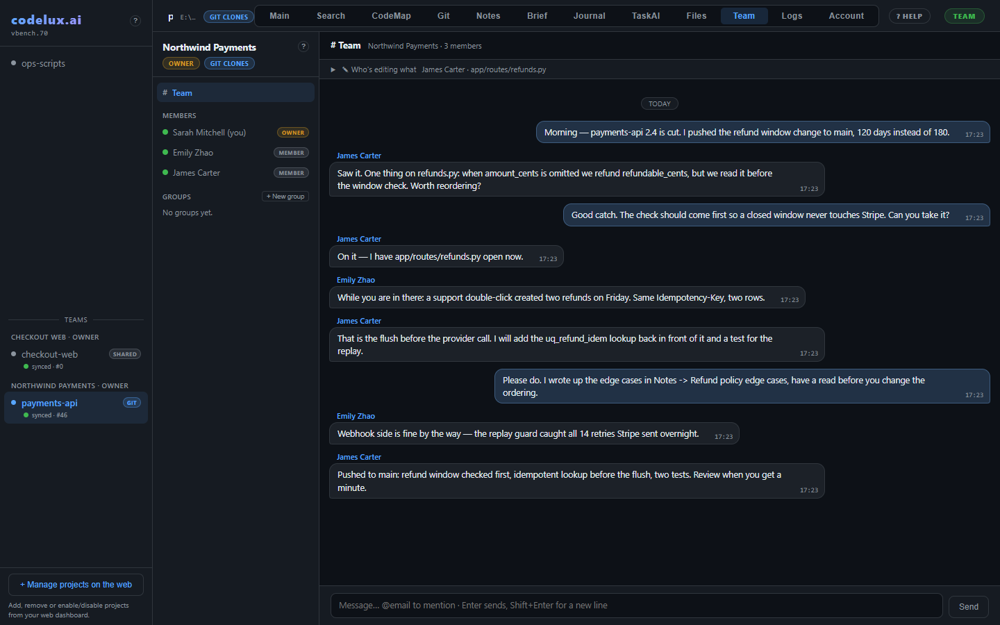
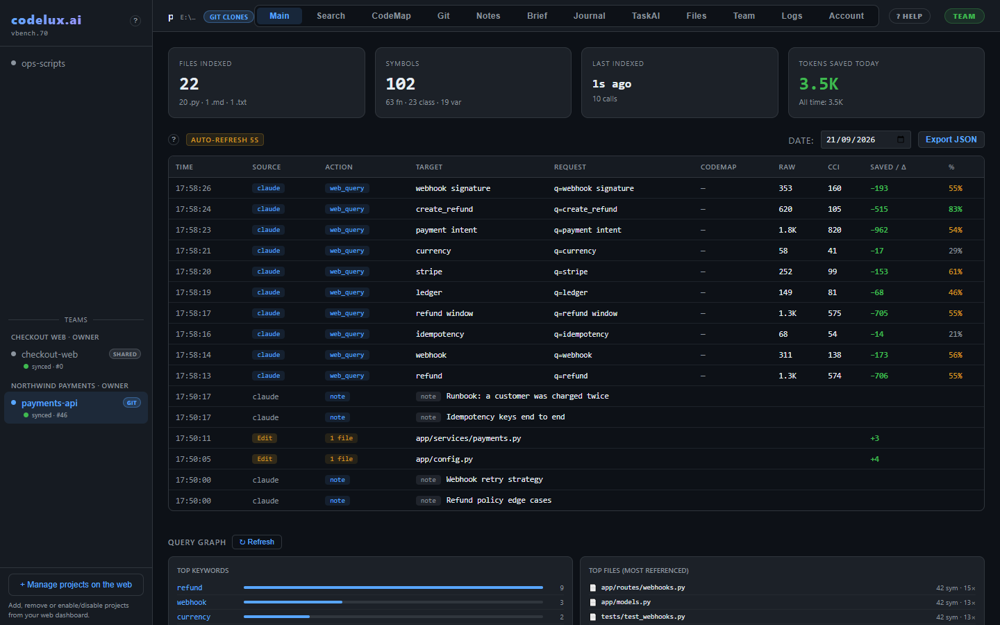

# Codelux

### A new helper for your AI

Your whole project, kept like a living book your AI can read from — low-token
algorithms, persistent memory, a live knowledge graph and instant search.
Notes, CodeMap, Brief, one guarded write path and a journal. Index and memory
stay on your machine; AI calls go only to the provider you choose.

 

## ⬇️ [Download Free — free account, no credit card](https://codelux.ai/download)

**[codelux.ai](https://codelux.ai)** · **[Docs](https://codelux.ai/docs)** · **[Pricing](https://codelux.ai/pricing)** · **[FAQ](https://codelux.ai/faq)** · **[X @codeluxai](https://x.com/codeluxai)**

 

---

## Get started

1. **[Download](https://codelux.ai/download)** the Free build for your platform — Windows, Linux (x86_64 / ARM64) or macOS (Apple Silicon / Intel, unsigned: right-click → Open the first time).
2. **Run it** — a local dashboard opens at `localhost`.
3. **Create your free account inside the app**, in seconds.

Free forever, one active project per machine, every feature unlocked, no time
limit, no card. Need more than one project at once? [Multi and Team](https://codelux.ai/pricing)
add unlimited projects and team collaboration.

Every download comes straight from [codelux.ai](https://codelux.ai/download):
the site builds and signs each binary, and the app checks its own integrity on
every start. Nothing to install from this repository.

---

## Teams — shared memory your server never reads

Multi and Team plans share notes, chat, journal and CodeMaps across a team,
**end-to-end encrypted**: the team key is generated in the owner's app and
handed to members over an authenticated channel; the server only stores
ciphertext and can neither read nor re-attribute a message. Projects sync as
Git clones or over a shared/network (SMB) folder, with live "who is editing
what" locks so two people never overwrite each other.

## What Codelux gives your AI

### Code Context
- **Smart Query** — boolean search with AND (`&`), OR (`|`) and NOT (`!`); fuzzy matching on name, intent, docs and semantic domains.
- **Compact File Reading** — read any file in CCI Compact format: 50–70% fewer tokens, lossless, with original line references so the AI can edit the real file.
- **Flow Analysis** — trace call flows from any entry point; recursive call trees with cycle detection and external-call markers.
- **Knowledge Graph** — a semantic graph builds itself with every query: keywords, files and symbols linked by real usage frequency.
- **CodeMap** — write a plain-language label like "backend / cache" and the on-board AI resolves it to exact files and symbols.
- **Raw Grep & Outline** — regex search across raw sources plus a structural outline of any file (functions, classes, methods, line numbers).
- **20 supported languages** — 16 with a real tree-sitter grammar (Python, JavaScript, TypeScript, Go, HTML, CSS, C/C++, C#, Rust, Java, PHP, SQL, Pascal/Delphi, Markdown), the rest with dedicated extractors (Vue, Svelte, Blazor Razor, JSON, YAML). Every other file type stays searchable with raw grep.

### Tokens
- **CCI Compression** — the Context Compression Index cuts symbol data by up to 90% while keeping every relevant detail.
- **Token Analytics** — every query logs raw vs. compressed tokens, visible on the dashboard.

### TaskAI
- **Background Requests** — hand work to a TaskAI and keep going; it runs in the background, stays queryable, and its whole history survives the process. Everything stays on your machine — no log of request sessions is kept.
- **History & Context Control** — a readable transcript of every request, its answer and its cost; each new request picks how much history to carry (whole task, last N, a time window, or none).
- **Your Providers, Your Models** — register a provider once, list its models, switch each on or off. Keys are sealed to this machine and never returned by the API.
- **Cost per Request** — model used and cost are recorded on the request itself and add up as it works.
- **Human in the Loop** — a request can pause and ask you a question mid-run; it resumes the moment you answer.
- **No Collisions** — TaskAI requests go through the same guarded write path as everyone else: serialized per file, anchored edits refuse the call when the expected text isn't there.

### Knowledge Base
- **Brief** — ask Codelux what it already knows about a task and get facts, symbols and recent edits back in one call.
- **Facts** — everything Codelux has learned about your project, each entry flagged fresh or "to recheck" when the underlying code changes.
- **Journal & Handoffs** — close a session with a checkpoint (done, open, gotchas, next step); the next session picks it up in one call.
- **Delta Detection** — every checkpoint freezes the state of the files it touched, so a handoff is never trusted blindly.
- **Topic Timelines** — checkpoints group under dotted topics like `Editor.Move`; ask for `Editor` and everything underneath surfaces, newest first.
- **Self-maintaining CodeMaps** — closing a checkpoint keeps its CodeMap in sync on its own.

### Memory & Notes
- **Cross-Session Memory** — `code_memory` returns a compact timeline of recent notes, edits and searches at the start of a session.
- **Smart Notes & Intent Tracking** — typed notes (intent, decision, todo, summary, schema, chat, research, snippet) that survive across sessions, retrievable via `code_memory` or `code_note`. Supports Mermaid diagrams and interactive forms.

### Watch Files
- **Live Reindex** — the file watcher reindexes changed files in seconds.
- **File Edit History** — every save tracked: files changed, symbols/lines added or removed, plus an AI-written summary of each edit.

### Git
- **Branches Viewer** — see branches and HEAD right from the dashboard (read-only: the AI never moves your working tree).
- **Commit, Push & Pull** — stage and commit from the dashboard, pull, and push once you approve the remote (the approval is bound to the remote URL); conflicts are shown, never committed.

### Files & Writes
- **Files Explorer** — browse the project tree with a built-in Monaco editor.
- **One Write Path** — every change goes through a single tool (anchored edits, a whole symbol, or a whole file), serialized per file, applied atomically, snapshotted first so it can be reverted whole. A blind whole-file overwrite is refused.
- **Multi-agent Coordination** — run several agents, sub-agents or git worktrees against the same project on one machine; a write is refused, not silently clobbered, if the file moved since it was read. Works on every plan, no server connection required.
- **Writes on MCP, HTTP and CLI** — `file_edit`, `file_delete`, `file_move`, `file_copy` and the `git_*` tools are available on all three protocols.

### Setup & Privacy
- **AI Self-Install** — your own AI configures itself from `GET /first-installation` or the CLI: MCP config, CLAUDE.md, hook suggestions. One request, zero manual JSON.
- **Local First** — your code index and session history live on your machine. No telemetry, no analytics. Account identity and device token are sealed to this machine. The AI features add one call to the provider you chose — Codelux keeps no log of what passes through.

---

## What's in this repo

This is Codelux's home on GitHub: the README you are reading and the two
screenshots. Downloads live on [codelux.ai/download](https://codelux.ai/download),
docs on [codelux.ai/docs](https://codelux.ai/docs). No source code here — see
[codelux.ai/legal](https://codelux.ai/legal) for licensing terms. Found a bug or
have an idea? Use **Help → Feedback & ideas** inside the app.

## Questions

- **Docs:** [codelux.ai/docs](https://codelux.ai/docs)
- **FAQ:** [codelux.ai/faq](https://codelux.ai/faq)
- **Support:** through your [dashboard](https://codelux.ai/dashboard) once signed in.
- **Follow:** [X @codeluxai](https://x.com/codeluxai) · [Reddit u/codelux_ai](https://www.reddit.com/user/codelux_ai/)
